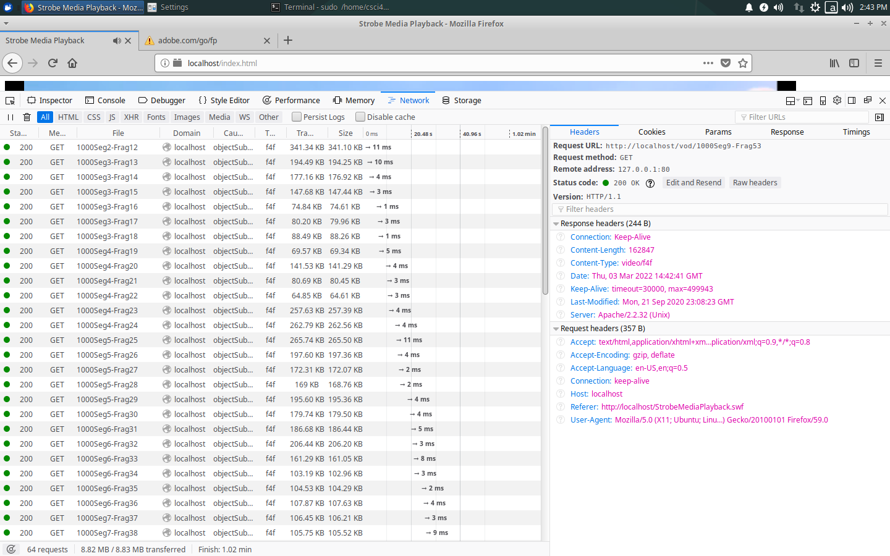

# code在miProxy里,建好proxy的client和server了，下一步parse the http header。。。

  

### share files from vmware in xubuntu 
```
sudo vim /etc/fstab
.host:/    /mnt/hgfs    vmhgfs    defaults    0    0
```

### connect internet
``` 
ip link
sudo ip link set ens33 up
sudo dhclient ens33 -v
```

### change time to enable flash
```
sudo date +%Y%m%d -s 20180101
```

### useful link
https://github.com/mgild/Networkp2.git  
https://github.com/heaventourist/Video-Streaming-via-CDN.git

### firefox header
``` 
GET /index.html HTTP/1.1
Host: 127.0.0.1:8888
User-Agent: Mozilla/5.0 (X11; Ubuntu; Linux x86_64; rv:59.0) Gecko/20100101 Firefox/59.0
Accept: text/html,application/xhtml+xml,application/xml;q=0.9,*/*;q=0.8
Accept-Language: en-US,en;q=0.5
Accept-Encoding: gzip, deflate
Connection: keep-alive
Upgrade-Insecure-Requests: 1
Cache-Control: max-age=0
```
```
Accept	
text/html,application/xhtml+xm…plication/xml;q=0.9,*/*;q=0.8
Accept-Encoding	
gzip, deflate
Accept-Language	
en-US,en;q=0.5
Connection	
keep-alive
Host	
localhost
Referer	
http://localhost/StrobeMediaPlayback.swf
User-Agent	
Mozilla/5.0 (X11; Ubuntu; Linu…) Gecko/20100101 Firefox/59.0
```

### server header
```
Connection	
Keep-Alive
Content-Length	
182637
Content-Type	
video/f4f
Date	
Thu, 03 Mar 2022 12:42:15 GMT
Keep-Alive	
timeout=30000, max=499988
Last-Modified	
Mon, 21 Sep 2020 23:08:23 GMT
Server	
Apache/2.2.32 (Unix)
```

### server response index.html
```html
HTTP/1.1 200 OK
Date: Mon, 01 Jan 2018 00:35:17 GMT
Server: Apache/2.2.32 (Unix)
Last-Modified: Mon, 01 Jan 2018 00:35:17 GMT
ETag: W/"49618-764-5afdaed4c2c8b"
Accept-Ranges: bytes
Content-Length: 1892
Keep-Alive: timeout=30000, max=500000
Connection: Keep-Alive
Content-Type: text/html

<!DOCTYPE html PUBLIC "-//W3C//DTD XHTML 1.0 Strict//EN" "http://www.w3.org/TR/xhtml1/DTD/xhtml1-strict.dtd">
<html xmlns="http://www.w3.org/1999/xhtml">
  <head>
    <title>Strobe Media Playback</title>
    <script type="text/javascript" src="swfobject.js"></script>
	<script type="text/javascript">  		
        var loc = window.location.host

    	// Create a StrobeMediaPlayback configuration
		var parameters =
			{	src: "http://"+loc+"/vod/big_buck_bunny.f4m"
   			,	autoPlay: true
			,	controlBarAutoHide: false
			,   javascriptCallbackFunction: "onJavaScriptBridgeCreated"
			};
    		
		// Embed the player SWF:
		swfobject.embedSWF
			( "StrobeMediaPlayback.swf"
			, "strobeMediaPlayback"
			, 1280
			, 720
			, "10.1.0"
			, {}
			, parameters
			, { allowFullScreen: "true"}
			, { name: "strobeMediaPlayback" }
			);

			
		function onCurrentTimeChange(time, playerId)
		{
			document.getElementById("currentTime").innerHTML = time;
		}
		
		function onDurationChange(time, playerId)
		{
			document.getElementById("duration").innerHTML = time;
		}
		var player = null;
		function onJavaScriptBridgeCreated(playerId)
		{
			if (player == null) {
				player = document.getElementById(playerId);
				
				// Add event listeners that will update the
				player.addEventListener("currentTimeChange", "onCurrentTimeChange");
				player.addEventListener("durationChange", "onDurationChange");
				
				// Pause/Resume the playback when we click the Play/Pause link
				document.getElementById("play-pause").onclick = function(){
					var state = player.getState();
					if (state == "ready" || state == "paused") {
						player.play2();
					}
					else
						if (state == "playing") {
							player.pause();
						}
					return false;
				};
			}
		}
    </script>  	
  </head>
  <body>
	<div id="strobeMediaPlayback">
      <p>Alternative content</p>
    </div>
  </body>
</html>
```
### response .f4m
```html
<manifest><id>
		10
	</id><streamType>
		recorded
	</streamType><duration>
		596.50133333333338
	</duration><bootstrapInfo profile="named" id="bootstrap5948">
		AAAMg2Fic3QAAAAAAAAAjwAAAAPoAAAAAAAJGgAAAAAAAAAAAAAAAAAAAQAAA0Fhc3J0AAAAAAAAAABmAAAAAQAAAAYAAAACAAAABgAAAAMAAAAGAAAABAAAAAYAAAAFAAAABgAAAAYAAAAGAAAABwAAAAYAAAAIAAAABgAAAAkAAAAGAAAACgAAAAYAAAALAAAABgAAAAwAAAAGAAAADQAAAAYAAAAOAAAABQAAAA8AAAAGAAAAEAAAAAYAAAARAAAABgAAABIAAAAGAAAAEwAAAAYAAAAUAAAABQAAABUAAAAGAAAAFgAAAAYAAAAXAAAABgAAABgAAAAGAAAAGQAAAAYAAAAaAAAABgAAABsAAAAGAAAAHAAAAAUAAAAdAAAABgAAAB4AAAAGAAAAHwAAAAUAAAAgAAAABgAAACEAAAAGAAAAIgAAAAUAAAAjAAAABgAAACQAAAAGAAAAJQAAAAYAAAAmAAAABgAAACcAAAAFAAAAKAAAAAYAAAApAAAABgAAACoAAAAGAAAAKwAAAAUAAAAsAAAABgAAAC0AAAAFAAAALgAAAAYAAAAvAAAABgAAADAAAAAFAAAAMQAAAAYAAAAyAAAABgAAADMAAAAGAAAANAAAAAYAAAA1AAAABgAAADYAAAAGAAAANwAAAAYAAAA4AAAABQAAADkAAAAGAAAAOgAAAAUAAAA7AAAABgAAADwAAAAGAAAAPQAAAAYAAAA+AAAABgAAAD8AAAAGAAAAQAAAAAYAAABBAAAABgAAAEIAAAAGAAAAQwAAAAYAAABEAAAABgAAAEUAAAAFAAAARgAAAAYAAABHAAAABgAAAEgAAAAGAAAASQAAAAUAAABKAAAABgAAAEsAAAAGAAAATAAAAAYAAABNAAAABQAAAE4AAAAGAAAATwAAAAYAAABQAAAABQAAAFEAAAAGAAAAUgAAAAYAAABTAAAABgAAAFQAAAAGAAAAVQAAAAYAAABWAAAABgAAAFcAAAAGAAAAWAAAAAYAAABZAAAABgAAAFoAAAAGAAAAWwAAAAYAAABcAAAABgAAAF0AAAAGAAAAXgAAAAYAAABfAAAABgAAAGAAAAAGAAAAYQAAAAYAAABiAAAABgAAAGMAAAAGAAAAZAAAAAUAAABlAAAABgAAAGYAAAAGAQAACRZhZnJ0AAAAAAAAA+gAAAAAkAAAAAEAAAAAAAAAAAAAA+gAAAAMAAAAAAAAKvgAAAdsAAAADQAAAAAAADJCAAAD6AAAAA8AAAAAAAA6EgAAA4QAAAAQAAAAAAAAPXUAAAPoAAAARQAAAAAAAQw6AAACvAAAAEYAAAAAAAEPGAAAA+gAAABHAAAAAAABEwAAAAOEAAAASAAAAAAAARZiAAAD6AAAAFAAAAAAAAE1ogAABqQAAABRAAAAAAABPCUAAAPoAAAAWQAAAAAAAVtlAAADIAAAAFoAAAAAAAFehQAAA+gAAABbAAAAAAABYm0AAAK8AAAAXAAAAAAAAWUIAAAD6AAAAHYAAAAAAAHKmAAABdwAAAB3AAAAAAAB0JUAAAPoAAAAeAAAAAAAAdR9AAADhAAAAHkAAAAAAAHYIgAAA+gAAAB7AAAAAAAB3/IAAAJYAAAAfAAAAAAAAeIpAAAD6AAAAJIAAAAAAAI4GQAAA4QAAACTAAAAAAACO74AAAPoAAAAlQAAAAAAAkOOAAACvAAAAJYAAAAAAAJGSgAAA+gAAACcAAAAAAACXboAAAOEAAAAnQAAAAAAAmFgAAAD6AAAAKEAAAAAAAJxAAAABwgAAACiAAAAAAACeCkAAAPoAAAAqQAAAAAAApOBAAACvAAAAKoAAAAAAAKWPQAAA+gAAACwAAAAAAACra0AAAJYAAAAsQAAAAAAAq/kAAAD6AAAALIAAAAAAAKzzAAABkAAAACzAAAAAAACui0AAAPoAAAAtAAAAAAAAr4VAAADIAAAALUAAAAAAALBFAAAA+gAAAC6AAAAAAAC1JwAAAOEAAAAuwAAAAAAAthBAAAD6AAAAL0AAAAAAALgEQAAA4QAAAC+AAAAAAAC45UAAAPoAAAAwAAAAAAAAutlAAADIAAAAMEAAAAAAALupgAAA+gAAADEAAAAAAAC+l4AAAXcAAAAxQAAAAAAAwBcAAAD6AAAAM8AAAAAAAMnbAAAArwAAADQAAAAAAADKkkAAAPoAAAA3QAAAAAAA10RAAACvAAAAN4AAAAAAANfrAAAA+gAAADgAAAAAAADZ3wAAAakAAAA4QAAAAAAA23+AAAD6AAAAOgAAAAAAAOJVgAAArwAAADpAAAAAAADi/EAAAPoAAAA8gAAAAAAA68ZAAACWAAAAPMAAAAAAAOxcQAAA+gAAAD7AAAAAAAD0LEAAAakAAAA/AAAAAAAA9dVAAAD6AAAAP0AAAAAAAPbPQAAA4QAAAD+AAAAAAAD3uIAAAPoAAAA/wAAAAAAA+LKAAACvAAAAQAAAAAAAAPlZQAAA+gAAAEBAAAAAAAD6U0AAAK8AAABAgAAAAAAA+voAAAD6AAAAQMAAAAAAAPv0AAABdwAAAEEAAAAAAAD9awAAAPoAAABBQAAAAAAA/mUAAACvAAAAQYAAAAAAAP8LgAAA+gAAAEHAAAAAAAEABYAAAakAAABCAAAAAAABAaZAAACvAAAAQkAAAAAAAQJNAAAA+gAAAEKAAAAAAAEDRwAAAK8AAABCwAAAAAABA+2AAAD6AAAARQAAAAAAAQy3gAABwgAAAEVAAAAAAAEOcUAAAPoAAABFwAAAAAABEF0AAADIAAAARgAAAAAAARElAAAA+gAAAEZAAAAAAAESHwAAAK8AAABGgAAAAAABEsWAAAD6AAAASQAAAAAAARyJgAAAyAAAAElAAAAAAAEdWgAAAPoAAABKQAAAAAABITmAAADhAAAASoAAAAAAASIjAAAA+gAAAFEAAAAAAAE7foAAAZAAAABRQAAAAAABPRcAAAD6AAAAU4AAAAAAAUXhAAAAlgAAAFPAAAAAAAFGf0AAAPoAAABUQAAAAAABSHNAAAF3AAAAVIAAAAAAAUnygAAA+gAAAFTAAAAAAAFK7IAAAOEAAABVAAAAAAABS8VAAAD6AAAAWMAAAAAAAVprQAAArwAAAFkAAAAAAAFbEgAAAPoAAABcwAAAAAABabgAAACvAAAAXQAAAAAAAWpnAAAA+gAAAF1AAAAAAAFrYQAAAZAAAABdgAAAAAABbPEAAAD6AAAAXcAAAAAAAW3rAAAArwAAAF4AAAAAAAFukYAAAPoAAABfQAAAAAABc2tAAADIAAAAX4AAAAAAAXQ7gAAA+gAAAGHAAAAAAAF9BYAAAZAAAABiAAAAAAABfpWAAACvAAAAYkAAAAAAAX9NAAAA+gAAAGMAAAAAAAGCOwAAAJYAAABjQAAAAAABgtEAAAD6AAAAY8AAAAAAAYTFAAABkAAAAGQAAAAAAAGGVQAAAPoAAABlAAAAAAABij0AAACvAAAAZUAAAAAAAYr0QAAA+gAAAGYAAAAAAAGN4kAAAK8AAABmQAAAAAABjokAAAD6AAAAaAAAAAAAAZVfAAAA4QAAAGhAAAAAAAGWQAAAAPoAAABpQAAAAAABmigAAAGpAAAAaYAAAAAAAZvZQAAA+gAAAGoAAAAAAAGdzUAAAJYAAABqQAAAAAABnmNAAAD6AAAAa0AAAAAAAaJLQAAA4QAAAGuAAAAAAAGjNIAAAPoAAABrwAAAAAABpCZAAAF3AAAAbAAAAAAAAaWlgAAA+gAAAGxAAAAAAAGmn4AAAOEAAABsgAAAAAABp4kAAAD6AAAAbMAAAAAAAaiDAAAAyAAAAG0AAAAAAAGpU0AAAJYAAABtQAAAAAABqfGAAAD6AAAAb0AAAAAAAbHBgAABkAAAAG+AAAAAAAGzUYAAAPoAAABygAAAAAABvwFAAAB9AAAAcsAAAAAAAb+GgAAA+gAAAHNAAAAAAAHBeoAAAZAAAABzgAAAAAABwwqAAAD6AAAAeEAAAAAAAdWYgAAAyAAAAHiAAAAAAAHWYIAAAPoAAAB5gAAAAAAB2kiAAACWAAAAecAAAAAAAdregAAA+gAAAHqAAAAAAAHdzIAAAMgAAAB6wAAAAAAB3p0AAAD6AAAAe4AAAAAAAeGLAAAA4QAAAHvAAAAAAAHibAAAAPoAAACRAAAAAAACNW4AAAHbAAAAkUAAAAAAAjdJAAAA+gAAAJUAAAAAAAJF7wAAAJYAAAAAAAAAAAAAAAAAAAAAAA=
	</bootstrapInfo><media streamId="10" url="10" bitrate="10" bootstrapInfoId="bootstrap5948"><metadata>
			AgAKb25NZXRhRGF0YQgAAAAAAAhkdXJhdGlvbgBAgqQCuwz4fgAFd2lkdGgAQIqwAAAAAAAABmhlaWdodABAfgAAAAAAAAAMdmlkZW9jb2RlY2lkAgAEYXZjMQAMYXVkaW9jb2RlY2lkAgAEbXA0YQAKYXZjcHJvZmlsZQBAU0AAAAAAAAAIYXZjbGV2ZWwAQEQAAAAAAAAADnZpZGVvZnJhbWVyYXRlAEA+AAAAAAAAAA9hdWRpb3NhbXBsZXJhdGUAQOdwAAAAAAAADWF1ZGlvY2hhbm5lbHMAQAAAAAAAAAAACXRyYWNraW5mbwoAAAACAwAGbGVuZ3RoAEGJmJzAAAAAAAl0aW1lc2NhbGUAQPX5AAAAAAAACGxhbmd1YWdlAgADdW5kAAAJAwAGbGVuZ3RoAEF7TkAAAAAAAAl0aW1lc2NhbGUAQOdwAAAAAAAACGxhbmd1YWdlAgADZW5nAAAJAAAJ
		</metadata></media><media streamId="100" url="100" bitrate="100" bootstrapInfoId="bootstrap5948"><metadata>
			AgAKb25NZXRhRGF0YQgAAAAAAAhkdXJhdGlvbgBAgqQCuwz4fgAFd2lkdGgAQIqwAAAAAAAABmhlaWdodABAfgAAAAAAAAAMdmlkZW9jb2RlY2lkAgAEYXZjMQAMYXVkaW9jb2RlY2lkAgAEbXA0YQAKYXZjcHJvZmlsZQBAU0AAAAAAAAAIYXZjbGV2ZWwAQEQAAAAAAAAADnZpZGVvZnJhbWVyYXRlAEA+AAAAAAAAAA9hdWRpb3NhbXBsZXJhdGUAQOdwAAAAAAAADWF1ZGlvY2hhbm5lbHMAQAAAAAAAAAAACXRyYWNraW5mbwoAAAACAwAGbGVuZ3RoAEGJmJzAAAAAAAl0aW1lc2NhbGUAQPX5AAAAAAAACGxhbmd1YWdlAgADdW5kAAAJAwAGbGVuZ3RoAEF7TkAAAAAAAAl0aW1lc2NhbGUAQOdwAAAAAAAACGxhbmd1YWdlAgADZW5nAAAJAAAJ
		</metadata></media><media streamId="500" url="500" bitrate="500" bootstrapInfoId="bootstrap5948"><metadata>
			AgAKb25NZXRhRGF0YQgAAAAAAAhkdXJhdGlvbgBAgqQCuwz4fgAFd2lkdGgAQIqwAAAAAAAABmhlaWdodABAfgAAAAAAAAAMdmlkZW9jb2RlY2lkAgAEYXZjMQAMYXVkaW9jb2RlY2lkAgAEbXA0YQAKYXZjcHJvZmlsZQBAU0AAAAAAAAAIYXZjbGV2ZWwAQEQAAAAAAAAADnZpZGVvZnJhbWVyYXRlAEA+AAAAAAAAAA9hdWRpb3NhbXBsZXJhdGUAQOdwAAAAAAAADWF1ZGlvY2hhbm5lbHMAQAAAAAAAAAAACXRyYWNraW5mbwoAAAACAwAGbGVuZ3RoAEGJmJzAAAAAAAl0aW1lc2NhbGUAQPX5AAAAAAAACGxhbmd1YWdlAgADdW5kAAAJAwAGbGVuZ3RoAEF7TkAAAAAAAAl0aW1lc2NhbGUAQOdwAAAAAAAACGxhbmd1YWdlAgADZW5nAAAJAAAJ
		</metadata></media><media streamId="1000" url="1000" bitrate="1000" bootstrapInfoId="bootstrap5948"><metadata>
			AgAKb25NZXRhRGF0YQgAAAAAAAhkdXJhdGlvbgBAgqQCuwz4fgAFd2lkdGgAQIqwAAAAAAAABmhlaWdodABAfgAAAAAAAAAMdmlkZW9jb2RlY2lkAgAEYXZjMQAMYXVkaW9jb2RlY2lkAgAEbXA0YQAKYXZjcHJvZmlsZQBAU0AAAAAAAAAIYXZjbGV2ZWwAQEQAAAAAAAAADnZpZGVvZnJhbWVyYXRlAEA+AAAAAAAAAA9hdWRpb3NhbXBsZXJhdGUAQOdwAAAAAAAADWF1ZGlvY2hhbm5lbHMAQAAAAAAAAAAACXRyYWNraW5mbwoAAAACAwAGbGVuZ3RoAEGJmJzAAAAAAAl0aW1lc2NhbGUAQPX5AAAAAAAACGxhbmd1YWdlAgADdW5kAAAJAwAGbGVuZ3RoAEF7TkAAAAAAAAl0aW1lc2NhbGUAQOdwAAAAAAAACGxhbmd1YWdlAgADZW5nAAAJAAAJ
		</metadata></media></manifest>
```
